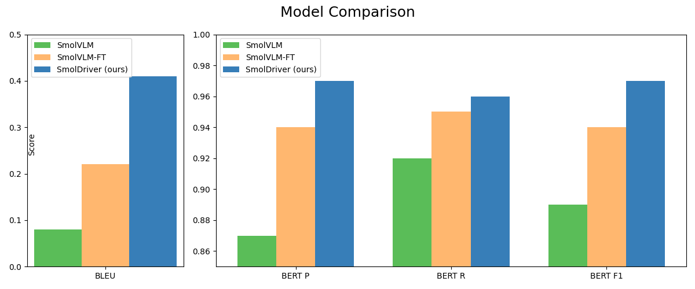

# SmolDriver: LLM Guided Efficient Autonomous Driving Model

## Abstract
In previous years, autonomous driving (AD) has 
become a challenging problem due to its system 2
nature and hard generalization (Chen et al., 2025),
(Li et al., 2025). Recently, with the emergence
of large language models (LLMs), many attempts
have been made to provide a general solution for
real-time and reliable driving (Wu et al., 2024),
(Yang et al., 2024), (Cui et al., 2023). Still,
most of those models lack one of the mentioned
aspects. We examined state-of-the-art methods
and came to the conclusion that integrating Vision
Language Models into autonomous driving comes
with two primary effects: firstly, the models, including LLMs or VLMs are more adaptive to unseen circumstances and generate better results due
to their vast knowledge and common sense, secondly, many Language models require powerful
and costly hardware and have too much computational overhead. For these reasons, we decided
to take a hybrid approach by guiding the planning
model with a LLM, leveraging its general adaptability while maintaining the memory and time efficiency of small models similar to DiMA (Hegdeet al., 2025). We decided to implement a framework that
leverages the power of LLMs and provides insight and scene understanding that can later be
used for guiding a smaller model to perform autonomous driving.

## Our Approach
We aimed to design a VLM and train via a question-answering (QA) task. The training is intended to help the model learn to extract meaningful visual features, which
can later facilitate the distillation of the LLM into a VAD in future work. The architecture of our proposed model is shown below:

## Training Stages
To train the new vision model, we used knowledge transfer principles. Then we fine-tuned the VLM by using Quantized-LoRA for all linear modules.

## Results
The evaluation results of the three models — SmolVLM, SmolVLM-FT, and our proposed SmolDriver — using BLEU and BERTScore are presented below.

---
For more details, please refer to the [paper](https://github.com/MehdiJmlkh/Large-Language-Models-Course-Project/blob/master/docs/SmolDriver.pdf) available in this repository.

